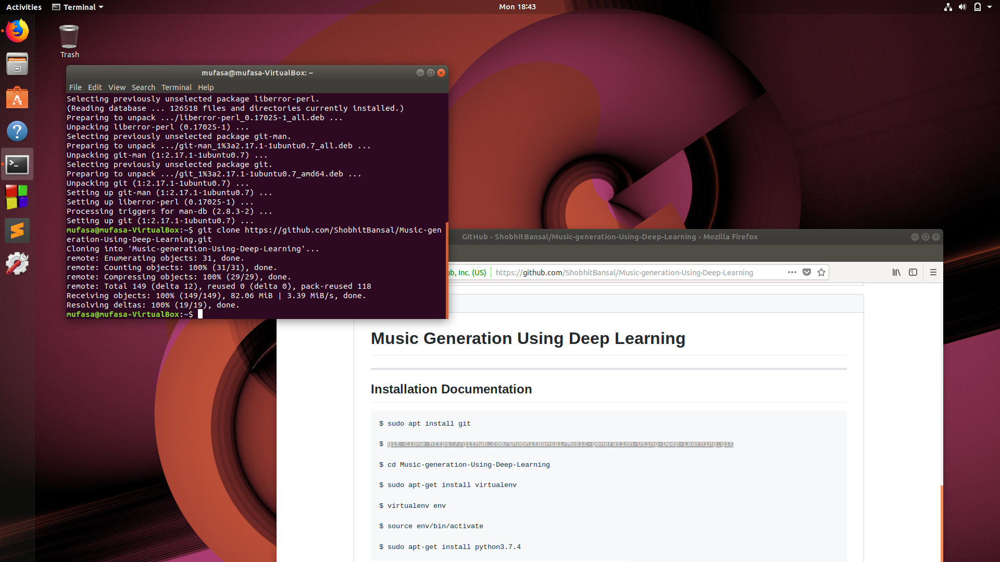
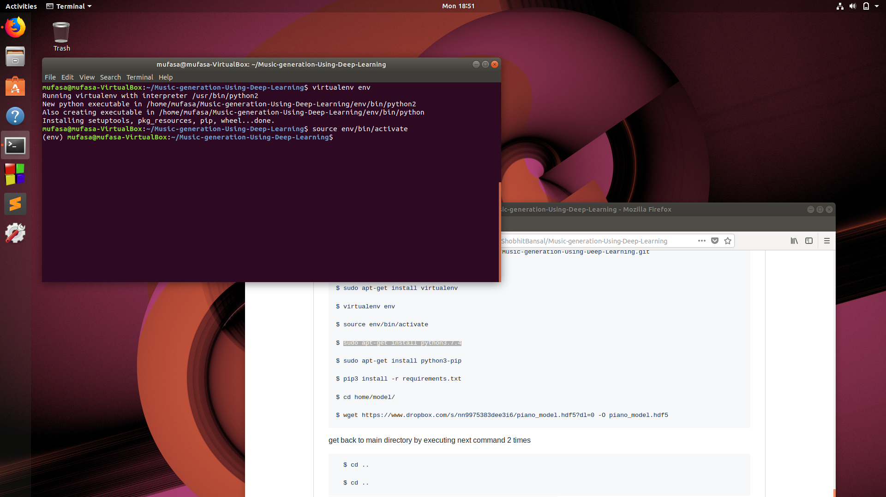
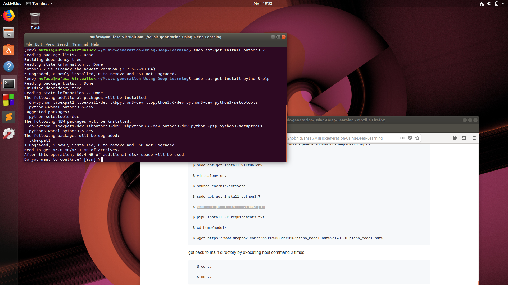
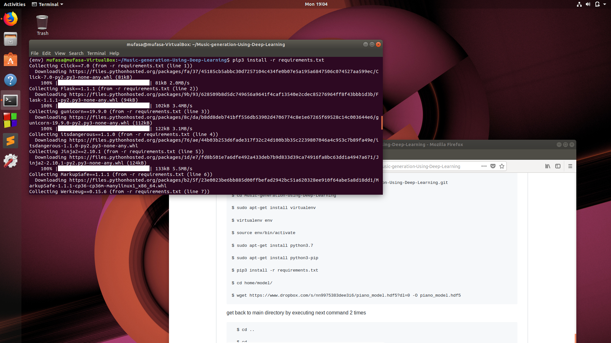
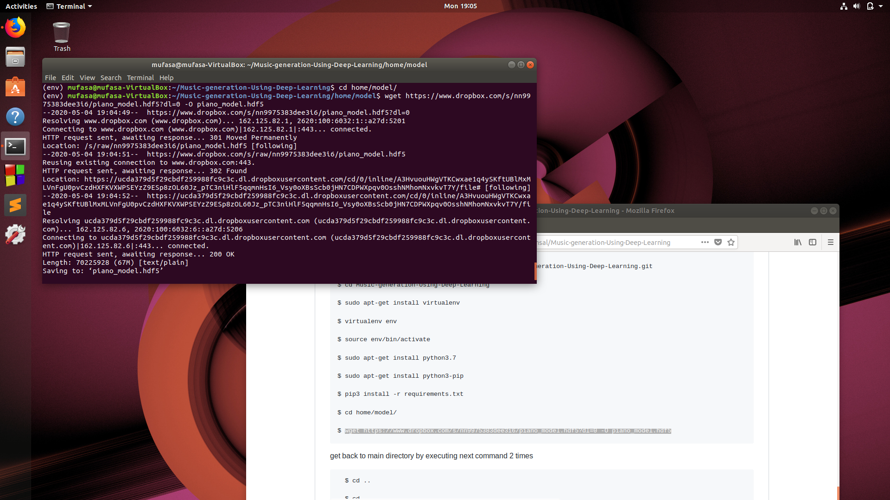
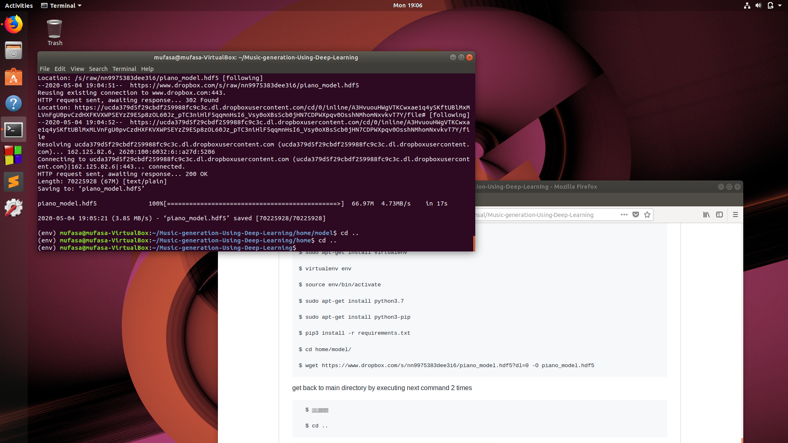
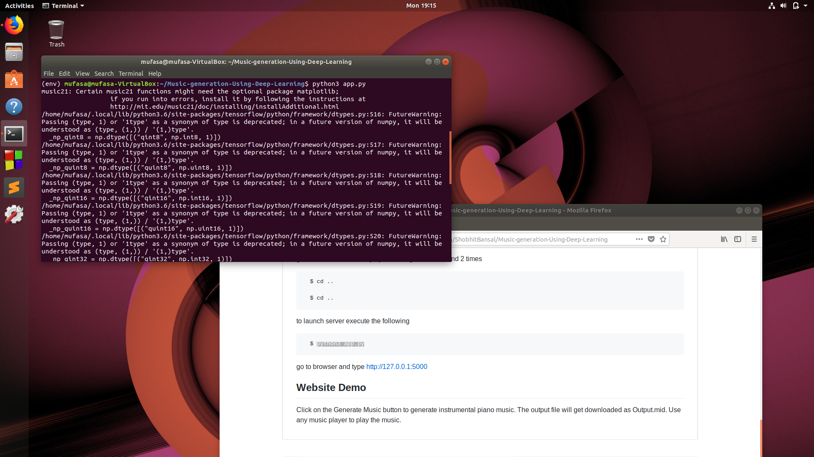
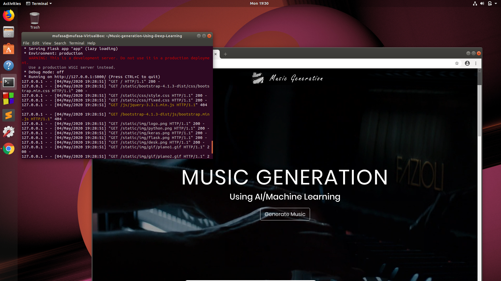
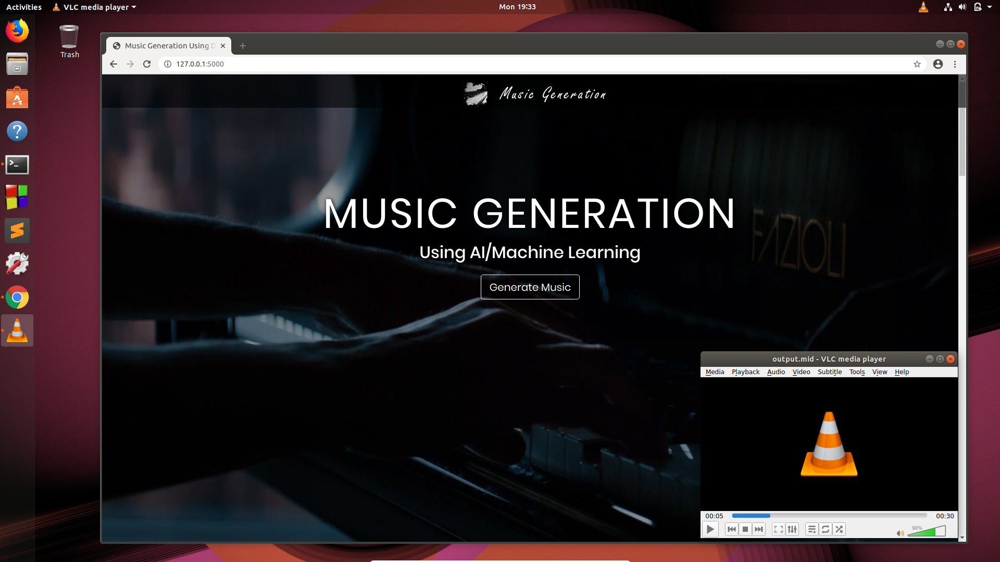

# Music Generation Using Deep Learning 

The Music Generation Model is based on Long short-term memory (LSTM), a recurrent neural network (RNN) architecture, that can efficiently learn via gradient descent.

The model is able to generate good quality instrumental music.

WEBSITE LINK: https://music-generation-using-ml.herokuapp.com/

## Installation Documentation

    $ sudo apt install git
    

    $ git clone https://github.com/ShobhitBansal/Music-generation-Using-Deep-Learning.git
    

  
    $ cd Music-generation-Using-Deep-Learning

    $ sudo apt-get install virtualenv
    

    $ virtualenv env

    $ source env/bin/activate
    

    
    $ sudo apt-get install python3.7
    
    $ sudo apt-get install python3-pip
    

    $ pip3 install -r requirements.txt
    

    
    $ cd home/model/
    
    $ wget https://www.dropbox.com/s/nn9975383dee3i6/piano_model.hdf5?dl=0 -O piano_model.hdf5
    

    
get back to main directory by executing next command 2 times

	  $ cd ..

	  $ cd ..
	  

    
to launch server execute the following

	  $ python3 app.py
	  

    
go to Google Chrome and type http://127.0.0.1:5000

 
## Website Demo
 
Click on the Generate Music button to generate instrumental piano music. The output file will get downloaded as Output.mid. Use any music player to play the music.

